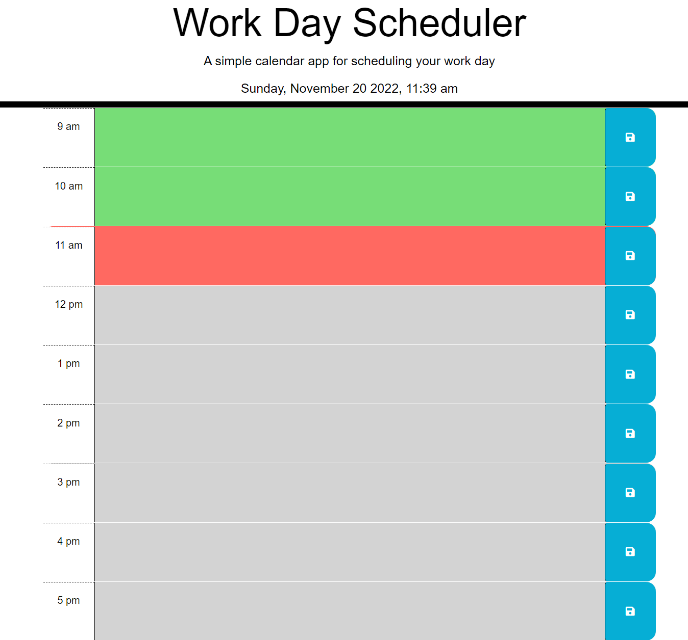

# Work Day Scheduler

## Description

A work day scheduler designed to make the day of a busy employee easier by being able to plan out daily tasks. This scheduler will color-code the hours to let you know what hours have passed, what the current hour is, as well as let the employee know what is coming up in the following hours. Local storage is utlized here to save these daily tasks so you can edit and update them as needed. 

## Links 

Link to live url: https://samualjensen.github.io/work-day-scheduler/

Link to repository: https://github.com/Samualjensen/work-day-scheduler

## Installation

No intallation needed, simply use the url provoded above and begin your scheduling adventure.

## Usage

When the webpage is deployed it can be viewed normally on a standard desktop browser. It has not yet been modified to fit a smaller screen yet.

## Credits 

Starter code was provided by Xandromus through Github and given to us though the Bootcamp spot. Some additional guidence and help was provided by the #askbcs learning assistant through slack.

## License

